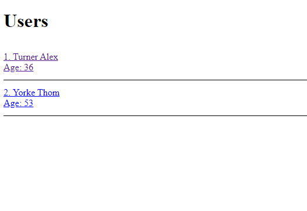
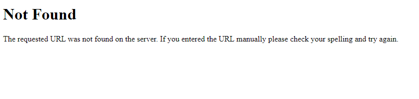

# Лаборатортная работа #1

В результате лабораторной работы сделан FLASK сервер со следующим функционалом:

1. Роут "/" редиректит на роут "/users"
2. Роут "/users" выведит список всех пользователей
3. Роут "/user/\<int: id\>" выводит информацию о пользователе с данным id, если такого не существует, то выдает ошибку 404

## Запуск проекта

```
pip install -r requirements.txt
python ./main.py
```

## Результат работы

Роут "/users"



Роут "/user/1"


Роут "/user/32231"


